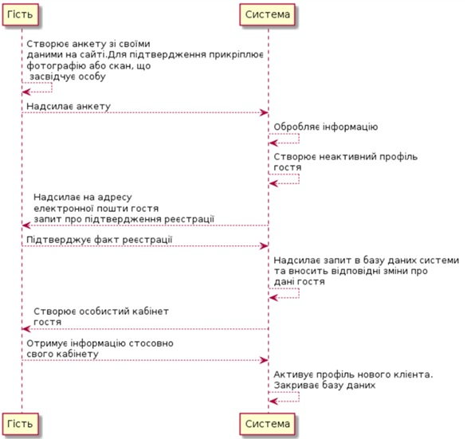
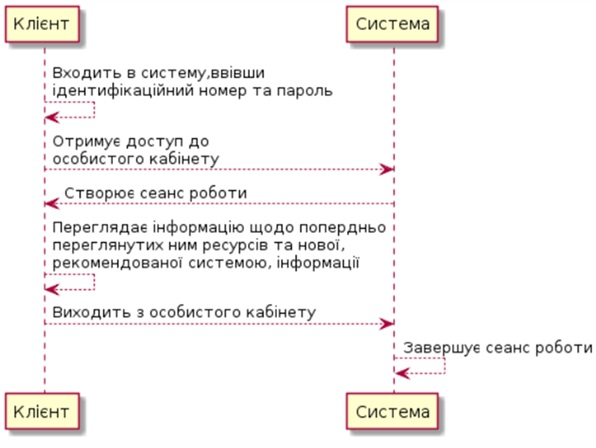
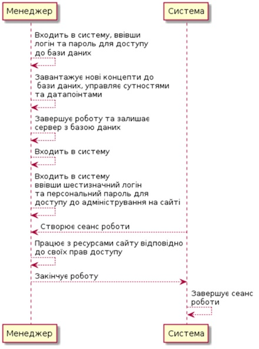
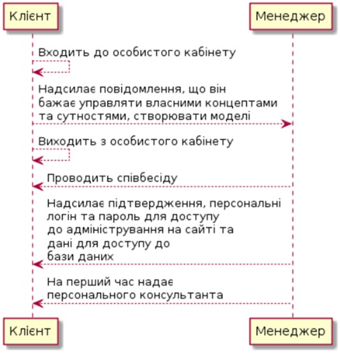

# Запити зацікавлених осіб
## Вступ
У цьому документі описані запити зацікавлених осіб по відношенню до розроблюваної системи «Управління даними для ресурсів Open Data», в якості яких виступають два типи користувачів: клієнт, менеджер.
1. Мета
Метою документа є визначення основних вимог щодо організації управління даними, а саме таких аспектів, як забезпечення інформацією усіх зацікавлених осіб, їх взаємодії за посередництвом системи.
2. Короткий огляд продукту
Систему «Управління даними для ресурсів Open Data» можна умовно розділити на дві частини програмного забезпечення:

    2.1. Сайт, який використовують зацікавлені особи в якості інтерфейсу доступу до усіх даних, що внесені до бази даних системи, а також інструменту для роботи з ними;

    2.2. База даних на головному сервері, що відображатиметься на сайті у вигляді таблиць.

3. Контекст
Перелік вимог, перерахованих у цьому документі, є основою технічного завдання для розробки системи для супроводу управління сутностями(entity), забезпечення інформацією клієнтів.

4. Ділові правила і приписи

    4.1. Призначення системи «Управління даними для ресурсів Open Data»

    Система призначена для забезпечення взаємодії між базою даних та інтерфейсом користувача на сайті проекту, а також встановлення формальних правил доступу до даних та можливостей роботи з ними для потенційних користувачів системою.
    Така організація зберігання даних будь-яких ресурсів Open Data та іншої інформації виключає можливість втрати інформації або порушення її конфіденційності.
    Також, використовуючи вищезазначену систему, можна отримати інформацію щодо будь-якого ресурсу Open Data.
    Отже, завдання системи «Управління даними для ресурсів Open Data» - надання швидкого доступу до необхідного ресурсу з можливістю перегляду та завантаження інформації.
            
    4.2. Політика взаємовідносин із зацікавленими особами

    При використанні  системи «правління даними для ресурсів Open Data» всі зацікавлені особи мають можливість використовувати програмне забезпечення системи відповідно до їх рівня доступу. Умови доступу до цієї системи встановлює політика конфіденційності.
    Клієнти реєструються в системі щоб мати доступ до пошуку, перегляду даних та їх завантаження.
    Менеджери мають повний доступ до системи, можуть завантажувати концепти, управляти сутностями(entity), управління датапоінтами(Datapoints).

    4.3. Сценарії

    4.3.1 Назва: сценарій реєстрації користувача для перегляду інформації.

        Учасники: Гість.
        Передумови: потенційний клієнт(гість) не зареєстрований у системі.
        Результат: зареєстровано нового клієнта.

    Сценарій:

    - Гість заповнює анкету своїми даними на сайті. Для підтвердження особи він прикріплює фотографію або скан будь-якого документу, що засвідчує особу.
    - Автоматично створюється неактивний профіль учасника.
    - Система інформацію.
    - Система надсилає на адресу електронної пошти гостя запит про підтвердження реєстрації.
    - Гість підтверджує факт реєстрації у системі.
    - Система надсилає запит базу даних системи та вносить відповідні дані про учасника.
    - Система створює для гостя особистий електронний кабінет.
    - Гість отримує персональний ідентифікаційний номер та пароль для подальшого доступу до особистого кабінету.
    - Профіль гостя автоматично активується.По завершенню роботи система закриває базу даних.

    Виключні ситуації:

    - Гість невірно заповнив поля анкети або залишив їх порожніми.
    - Гість не підтвердив факт реєстрації у системі.
    - Порушено зв’язок між сервером із базою даних та сайтом.

    4.3.2. Назва: сценарій доступу до особистого кабінету.

    Учасники: клієнт.
    Передумови: клієнт зареєстрований у системі.
    Результат: перевірено поточні дані клієнта.

    Сценарій:

    - Клієнт вводить ідентифікаційний номер та пароль.
    - Клієнт отримує доступ до особистого кабінету.
    - Автоматично створюється сеанс роботи.
    - Клієнт переглядає інформацію щодо попередньо переглянутих ним ресурсів та нової рекомендованої системою інформації.
    - Клієнт виходить із особистого кабінету.
    - Сеанс роботи автоматично завершується.

    Виключні ситуації:

    - Клієнт невірно ввів ідентифікаційний номер та пароль або залишив поля порожніми.

    4.3.3. Назва: сценарій адміністрування ресурсів менеджером

        Учасники: менеджер.
        Передумови: менеджер має доступ до адміністрування.
        Результат: внесено зміни до даних на сайті.
    Сценарій:

    - Менеджер вводить логін та пароль для доступу до бази даних.
    - Менеджер завантажує нові концепти до бази даних відповідно до змін у тендеціях попиту на певний ресурс, управляє сутностями та датапоінтами.
    - Менеджер завершує роботу та залишає сервер з базою даних.
    - Менеджер вводить шестизначний логін та персональний пароль для доступу до адміністрування на сайті.
    - Автоматично створюється сеанс роботи.
    - Менеджер працює з ресурсами сайту відповідно до своїх прав доступу.
    - Менеджер закінчує роботу.
    - Сеанс роботи автоматично завершується.

    Виключні ситуації:

    - Менеджер невірно ввів логін та пароль або залишив поля порожніми.
    - Порушено зв’язок між сервером із базою даних та сайтом.

    4.3.2. Назва: сценарій переходу з категорії «Клієнт» до категорії «Менеджер».

        Учасники: Клієнт, Менеджер.
        Передумови: клієнт бажає сам управляти певними сутностями і датапоінтами.
        Результат: зареєстровано нового організатора.
    Сценарій:
    - Клієнт заходить до особистого кабінету.
    - Клієнт надсилає менеджеру повідомлення, що він бажає управляти власними концептами та сутностями, створювати свої моделі.
    - Клієнт виходить з особистого кабінету.
    - Клієнт проводить співбесіду з менеджером.
    - Менеджер надсилає учасникові підтвердження, персональні логін та пароль для доступу до адміністрування на сайті та дані для доступу до бази даних.
    - Кожному клієнту, який перейшов у категорію менеджерів, на перший час надається персональний консультант.

    Виключні ситуації:

    - На співбесіді менеджер вирішив відхилити запропоновану кандидатуру.

5.  Функціональність

    Основні вимоги до функціональності, пред'явлені зацікавленими особами, відносяться до трьох категорій :

    - Гість
    - Клієнт
    - Менеджер

    5.1. Структура сайту системи «Управління даними для ресурсів Open Data.»

    Сайт системи повинен мати наступні розділи:
    - Реєстрація – розділ, в якому будь-який бажаючий зможе зареєструватися на сайті.
    - Вхід до особистого кабінету – дає можливість переглянути персональну сторінку клієнта.
    - Керування та оцінювання – розділ виключно для менеджерів в ньому можна додати нового клієнта власноруч(зареєструвати), керувати сутностями, датапоінтами, створювати нові моделі та завантажувати концепти. Також давати оціку ресурсам.
    - Новини – інформація про поточні тенденції і попит на певні ресурси.
    - Контакти – телефони для довідок менеджера системи, адреса за яким можна звертатися.

    5.2. Можливості зацікавлених осіб

    5.2.1. Можливості  гостя
    * Реєструватися на сайті
    * Частково переглядати інформацію
    * Надіслати організаторам запит щодо переходу у категорію менеджерів
    * Переглядати новини
    * Переглядати контактну інформацію.

    5.2.2. Можливості  клієнта
    * Доступ до особистого кабінету
    * Пошук і перегляд інформації
    * Завантажувати інформацію
    * Надіслати організаторам запит щодо переходу у категорію менеджерів
    * Переглядати новини
    * Переглядати контактну інформацію

    5.2.3. Можливості менеджера
    * Мати персональний доступ до керування сайтом
    * Реєструвати гостей
    * Публікувати новини
    * Переглядати новини
    * Управління сутностями(entity)
    * Управління датапоінтами
    * Завантажувати концепти
    * Вносити зміни до моделей, додавати моделі
    * Завантажувати архів  інформації наявних ресурсів
    * Публікувати контактну інформацію
    * Переглядати контактну інформацію.

6. Практичність

    6.1. Стандартизація

    Система надає доступ до інформації кожному її користувачеві відповідно до його приналежності до однієї з трьох категорій.

    6.2. Інтерфейс користувача

    Інтерфейс сайту системи «Управління даними для ресурсів Open Data» відповідає наступним вимогам:

    * Зрозумілий і не допускає двозначного тлумачення.
    * Виконаний з урахуванням ергономічних вимог.
    * Всі кодовані параметри або елементи, наведені скорочення повинні мати розшифрування або вікно-підказку, що буде з'являтися після наведення курсору на елемент або після натискання спеціальної клавіші.

7.  Надійність

    Протягом терміну зберігання інформації, сутностей і концептів повинна бути забезпечена їх цілісність.
    Для забезпечення збереження та цілісності менеджером буде використовуватися метод резервного копіювання.
    Для забезпечення незмінності та достовірності менеджерами буде використовуватися комплекс технологічних і адміністративних процедур, що перешкоджають випадковій або навмисній зміні збережених даних із бази.
    Також повинна бути забезпечена конфіденційність персональної інформації. Надання доступу до персональних даних менеджери здійснюють у відповідності з правами доступу відвідувача.

### Сценарії

 Назва:Реєстрація кабінету

 Учасники:гість, система.

 Передумови:гість не зареєстрований у системі.

 Результат:зареєстровано нового учасника досліджень.

## Сценарій:

	Гість заповнює анкету своїми даними на сайті. Для підтвердження особи він прикріплює фотографію або скан будь-якого документу, що засвідчує особу.

	Гість надсилає анкету організаторам.

	Система обробляє інформацію.

	Система створює неактивний профіль учасника.

	Система надсилає на адресу електронної пошти гостя запит про підтвердження реєстрації.
	
	Гість підтверджує факт реєстрації у дослідах.

	Система надсилає запит в базу даних системи та вносить відповідні зміни про дані гостя.

	Система створює для учасника особистий електронний кабінет.

	Гість отримує інформацію стосовно свого кабінету.

	Система активує профіль нового клієнта. Закриває базу даних.

## Виключні ситуації:

	Гість невірно заповнив поля анкети або залишив їх порожніми.

	Гість не підтвердив факт реєстрації у дослідах.

	Порушено зв&#39;язок між сервером із базою даних та сайтом.

Назва:Перегляд інформації.

Учасники:клієнт, система.

Передумови:клієнт зареєстрований для досліджень.

Результат:перевірено поточні дані клієнта.

## Сценарій:

	Клієнт входить в систему, ввівши  ідентифікаційний номер та пароль.

	Клієнт отримує доступ до особистого кабінету.

	Система створює сеанс роботи.

	Клієнт переглядає інформацію щодо попередньо переглянутих ним ресурсів та нової, рекомендованої системою інформації.

	Клієнт виходить із особистого кабінету.

	Система завершує сеанс роботи.

## Виключні ситуації:

	Клієнт невірно ввів ідентифікаційний номер та пароль або залишив поля порожніми.

Назва:Адміністрування ресурсів менеджером.

Учасники: менеджер, система.

Передумови:менеджер має доступ до адміністрування.

Результат:внесено зміни до даних на сайті.

## Сценарій:

	Менеджер входить в систему, ввівши логін та пароль для доступу до бази даних.

	Менеджер завантажує нові концепти до бази даних, управляє сутностями та датапоінтами.

	Менеджер завершує роботу та залишає сервер з базою даних.

	Менеджер входить в систему.

	Менеджер входить в систему ввівши шестизначний логін та персональний пароль для   доступу до адміністрування на сайті.

	Система створює сеанс роботи.

	Менеджер працює з ресурсами сайту відповідно до своїх прав доступу.

	Менеджер закінчує роботу.

	Система завершує сеанс роботи.

## Виключні ситуації:

        Менеджер невірно ввів логін та пароль або залишив поля порожніми.

        Порушено зв&#39;язок між сервером із базою даних та сайтом.

Назва:сценарій переходу з категорії «клієнт» до категорії «менеджер».

Учасники:клієнт, менеджер.

Передумови:клієнт зареєстрований і бажає стати менеджером.

Результат:зареєстровано нового менеджера.

## Сценарій:
	Клієнт заходить до особистого кабінету.

	Клієнт надсилає повідомлення, що він бажає управляти власними концептами та сутностями, створювати моделі.

	Клієнт виходить з особистого кабінету.

	Менеджер проводить співбесіду з клієнтом.

	Надсилає клієнту підтвердження, персональні логін та пароль для доступу до адміністрування на сайті та дані для доступу до бази даних.

	Менеджер на перший час надає персонального консультанта.

## Виключні ситуації:

	На співбесіді вирішили відхилити запропоновану кандидатуру.
