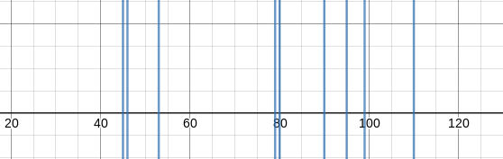
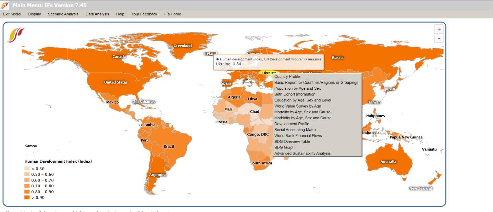
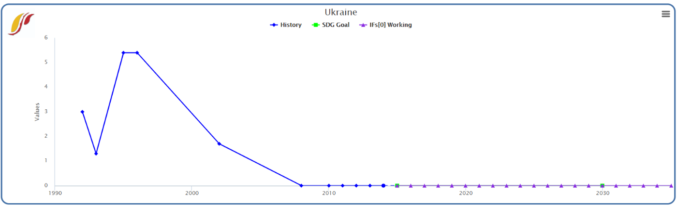
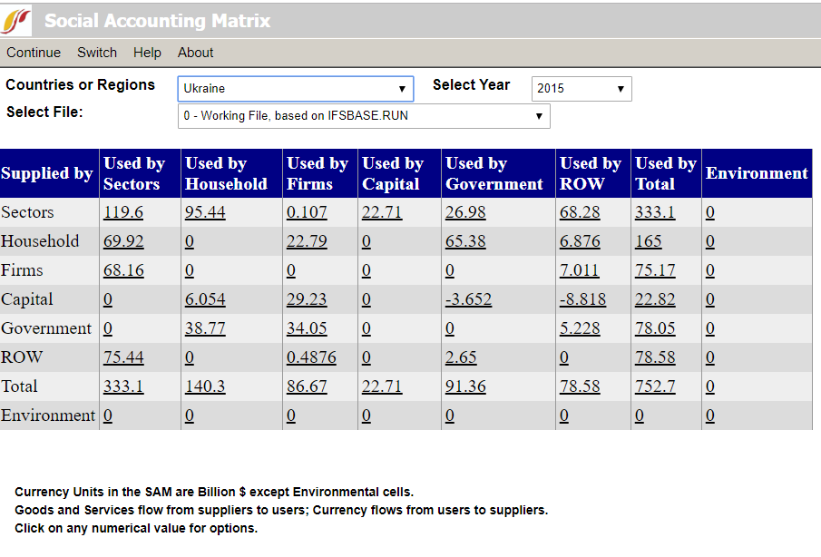
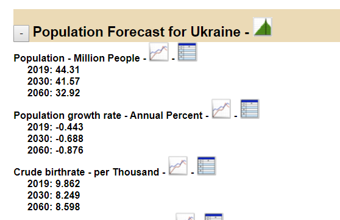
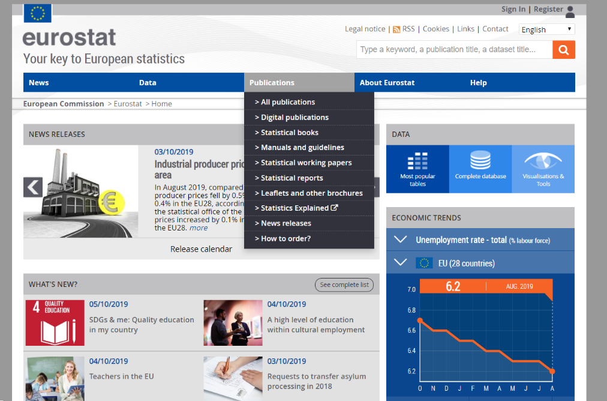
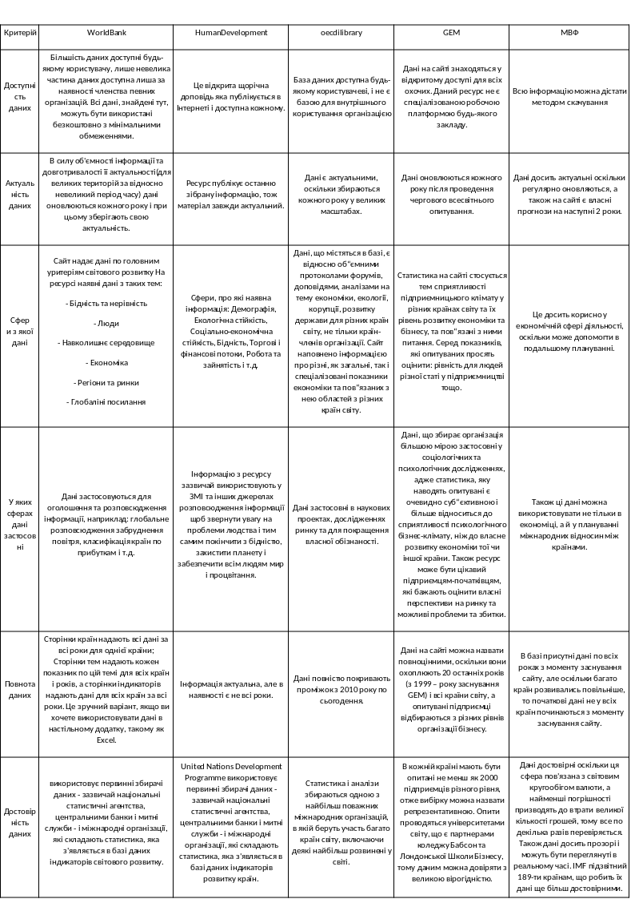
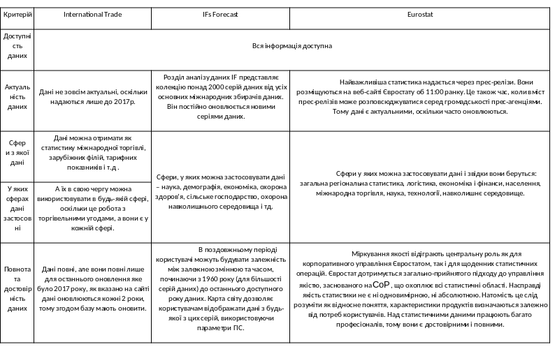

# Запити зацікавлених осіб
## Вступ ^
Попит на якісні статистичні дані продовжує зростати. Своєчасна і надійна статистика є ключовим внеском в широку стратегію розвитку. Хороші дані необхідні для встановлення вихідних умов, визначення ефективних державних і приватних дій, встановлення цілей і завдань, моніторингу прогресу та оцінки впливів. У даній роботі буде розглянуто 10 різних сервісів, що забезпечують можливість пошуку, обробки та виведення даних. А саме The World Bank, Human Development, OECD Factbook( oecd-ilibrary.org), gemconsortium.org, International Monetary Found, International Trade, Global Competitiveness Report World Economic Forum, ICT Statistics Database, Eurostat, IFs Forecast.
## Сервіси та програмне забезпечення
### 1. Створення сервісів ^
The World Bank як міжнародна фінансова організація була створена 27 грудня 1945 з метою організації фінансової та технічної допомоги країнам, що розвиваються. Окрім того є однією із двох (поряд з Міжнародним валютним фондом) великих фінансових організацій, створених за підсумками Бреттон-Вудської конференції, що відбулася в США в 1944 році. Делегати з 45 країн, в тому числі представники Радянського Союзу, обговорювали питання відновлення економіки і пристрої світового господарства після Другої світової війни.

В той час як Human Development Report був вперше оприлюднений у 1990 році пакистанським економістом Махбубом уль Хаком та індійським нобелівським лауреатом Амартією Сен.

OECD Factbook був створений набагато пізніше, а саме у 2010 році силами OECD (Organisation for Economic Co-operaion and Development) (укр. Організація Економічної Співпраці та Розвитку - ОЕСР) - міжнародної організації, до якої входять близько 30 країн світу, які надають інформаційну та матеріальну допомогу одна одній в сфері економіки та протидії корупції.

GEM (укр. Глобальний Монітор Підприємництва) засновано у 1999 році коледжем Бабсон та Лондонською Школою Бізнесу, але до програми за 20 років приєднались багато інших університетів.

Міжнародний валютний фонд був створений в 1945 р. та зараз керується й підзвітний 189 країнам, які складають його майже глобальне членство.

International Trade заснований 1 січня 1995 р. Зараз його члени налічують 164 країни, що представляють 98 відсотків світової торгівлі. В його основі лежать угоди СОТ, погоджені та підписані більшістю світових торгових країн та ратифіковані у своїх парламентах.

Проект International Futures (IFs) розпочався в 1980 році з створення Баррі Х'юза першого покоління моделі IF. Протягом останніх трьох десятиліть Баррі очолював зростаючу команду IF у процвітаючому центрі та контролював еволюцію моделі IF протягом багатьох поколінь.

Євростат був створений у 1953 році для задоволення вимог Спільноти з вугілля та сталі. Протягом багатьох років її завдання розширювались, і коли було засновано Європейське співтовариство у 1958 році, він став Генеральною Директорією (ГД) Європейської Комісії

На всесвітньому економічному форумі з 1979 року фахівці ВЕФ складають щорічну доповідь «Глобальна конкурентоспроможність» (Global Competitiveness Report), в якому оцінюють більш ніж 100 країн світу за двома головними показниками - індексом потенційного зростання і індексом конкурентоспроможності.

Рис.1.Діаграма розподілу по роках створення. 0 - 1990р, 100 - 2000р

З діаграми можна помітити, що хоча деякі сервіси були створенні в середині 20-того століття, проте більшість з них все ж розпочали своє існування після 80-х років минулого століття. Крім цього, аналізуючи ці залежності можна зазначити, що актуальність та попит у даній сфері збільшувалися і ймовірно, будуть й далі зростати.
### 2. Мета створення та загальні концепції^
Група World Bank веде роботу у всіх основних областях розвитку. Вона надає широкий спектр фінансових продуктів і технічної допомоги, а також допомагає країнам ділитися інноваційними знаннями і рішеннями стоять перед ними проблем і застосовувати їх на практиці.

Метою Human Development було поставити людей у ​​центр процесу розвитку з точки зору економічних дебатів, політики та адвокації. Розвиток характеризувався наданням вибору та свобод, що спричиняло широкі результати.

Місія Євростату полягає у наданні високоякісної статистики для Європи. Євростат пропонує цілу низку важливих та цікавих даних, які можуть використовувати уряди, підприємства, сектор освіти, журналісти та громадськість для своєї роботи та повсякденного життя.

Сайт Організації Економічної Співпраці та Розвитку створено з метою відкритого доступу до статистичних даних країн світу (показників економіки, розвитку та ін.), що збираються та аналізуються організацією, пересічним користувачем.

International Futures (IFs) - це глобальна модель інтегрованої оцінки, покликана допомогти стратегічно та систематично розмірковувати про ключові глобальні системи (економічну, демографічну, освіту, охорону здоров'я, технології, внутрішнє управління, інфраструктуру, сільське господарство, енергетику та навколишнє середовище).

Метою GEM є створити придатний бізнес-клімат у всьому світі та зібрати достовірні дані про підприємництво у різних країнах. Тому раз на рік сервіс збирає дані у вигляді опитувань близько 2000 підприємців з кожної країни світу (їх просять оцінити такі показники, як страх провалити бізнес, рівень державної підтримки, рівень доходів та інші).

Основна мета МВФ - забезпечити стабільність міжнародної валютної системи - системи валютних курсів та міжнародних платежів. Фонд прагне давати змогу країнам (та їх громадянам) здійснювати взаємодії між собою.

International Trade прагне забезпечити, щоб торгівля протікала максимально плавно, передбачувано і вільно. Основною метою є відкриття торгівлі на благо всіх.

Аналізуючи можна зробити висновок, що майже всі сервіси були створенні задля покращення певного сектору людських життя та діяльності. Важливою спільною цілю для деяких сайтів є проінформувати населення у певній сфері, надати доступ до необхідних даних, надавати допомогу вирішенні питань, що розглядаються у даних сферах. Інші сервіси прагнуть забезпечити стабільність процесів фінансової, валютної, торгівельної та інших сфер, їх контролювати задля блага усіх.
### 3. Інтерфейс ^
Сайт World Bank має інтерфейс призначений для полегшення пошуку, завантаження і використання даних World Bank. Сайт ресурсу WORLD DEVELOPMENT INDICATORS має доволі приємний інтерфейс, який інтуїтивно зрозумілий пересічному користувачу. Дизайн виконаний в мінімалістичних синьо-білих тонах. Функціонал є звичним та представлений пошуковою системою, системою завантаження інформації. Найпростіший спосіб пошуку даних - використовувати вікно пошуку в верхній частині сторінки. 

Ви можете шукати імена індикаторів, країни і теми. У вікні пошуку відображається список співпадаючих результатів при введенні тексту; просто виберіть один з відповідних термінів, щоб миттєво відобразити результат. Зверніть увагу, що ви можете відображати тільки один індикатор за раз. Ви можете подивитися комбінації індикаторів і країн або декількох країн, додавши додаткові елементи в поле пошуку. Однак ви можете відображати тільки один індикатор за раз. Щоб почати все спочатку, клацніть значок будинка  праворуч від поля пошуку. Ви також можете переглядати списки країн і показників, які можна знайти в меню сайту .

United Nations Development Programme це сайт з усією актуальною інформацією по більшості країн. Для пересічного користувача інтерфейс достатньо простий, хоча кнопка пошуку і не знаходиться на головній сторінці. Дизайн мінімалістичний, виконаний в синьо-білих тонах. Для пошуку необхідної інформацію про певну країну слід в боковому меню вибрати пошук і ввести назву необхідної країни.

OECD Factbook. Структура ресурсу логічна і не має зайвих елементів: на головній сторінці користувачеві пропонують передивитись свіжу та цікаву інформацію, а панель керування зверху дозволяє отримати доступ до даних, відсортувавши дані за темою, країною, засобом представлення тощо. 3а всі елементи сайту мають однозначну функцію і стисле пояснення. Сайт дуже лаконічний і функціональний, при цьому всі важливі елементи збережено (приміром, функцію зміни мови). Оформлення сайту більшою мірою біле з коричневими, зеленими та синіми елементами, що створює економічно-екологічно-соціальну атмосферу. Графічна оболонка відповідає тематиці бази даних і не відволікає від головного. Ресурс має функціонал, що дозволяє легкий доступ до бази даних та інших елементів. Є можливість додати дані в «Улюблені», змінити мову, увійти в особистий кабінет та інші корисні функції, які однак не заважають власне перегляду бази.

Глобальний Монітор Підприємництва. На головній сторінці сайту пояснюють, де знаходиться користувач і яка головна мета ресурсу, а також останні новини з тематики сайту. Через меню зверху відкривається доступ до даних, які об'єднані у декілька груп – характеристика підприємництва по країнах, глобальні річні доповіді GEM та інші. 3а Всі посилання на сайті стило і чітко пояснюються, сайт не перевантажено зайвими елементами. До будь-яких даних зрозуміло як отримати доступ. Загалом сайт дуже функціональний. Ресурс має типовий для такого роду сайтів дизайн – білий фон та сині функціональні елементи. Однак, це позитивно, оскільки дозволяє фокусуватись на роботі над даними. Ресурс має очевидну направленість бути контейнером для статистичних даних організації і виконує дану функцію без зайвих елементів у оформленні та структурі.

International Monetary Found. Інтерфейс досить легкий у користуванні, все доволі зрозуміло для пересічного громадянина, головні сторінки винесені в шапку сайту, що досить зручно, а допоміжні силки і посилання знаходяться праворуч, тобто не потрібно нічого шукати. Все знаходиться в разовій доступності. Дані можна запросити, як окремо для деякої країни, так і весь їх перелік. Дизайн приємний для сприйняття, як уже говорилось раніше все в разовій доступності, кольори підібрані досить добре, оскільки вони заспокійливі і не створюють зайвого контрасту, тобто знаходитись на сайті досить комфортно. Мінусом є те, що структура та зовнішній вигляд змінюються при переході між розділами, що відволікає увагу. Функціонал досить таки повний, можна подивитись нові публікації, на сайті представленні книги з власними дослідженнями щодо світової економіки та фінансів.

International Trade. Сайт оформлений досить правильно, є меню. При наведенні на якусь з тем, з'являється додаткове випадаюче меню, що допомагає легше орієнтуватися по сайту. Дизайн сайту простий хоч досить цікавий та сучасний, він не відволікає від основної мети відвідування сайту. Функціонал дуже обширний, сайт має багато функцій, починаючи від допомоги сільському господарству, закінчуючи наданням послуги переговорів. Також дана організація зацікавлена в розумних працівниках, тому надає можливість студентам навчатися на власних кафедрах і якщо вони проявлять себе, то надають роботу, також СОТ встановила щорічну премію Есе для молодих економістів СОТ в 2009 році. Премія, яка присуджує приз в розмірі 5000 швейцарських франків, має на меті сприяти високоякісним економічним дослідженням з питань СОТ та ВТО.

International Futures (IFs). Модель включає динамічно пов'язані підмоделі. Інтерфейс версії 7.45 є простим, але одночасно зрозумілим і легким для входження новому користувачу. Інтуїтивно зрозуміло, куди потрібно натискати, щоб отримати ту інформацію, яка вам потрібна. Після натисканя на вкладку “Country profile” на екрані з’являється структурований текст, який поділений на теми та підтеми, що є дуже зручним при пошуку чогось конкретного. Щодо функціональності, то вона є надзвичайно великою, оскільки ви можете переглядати діаграми, графіки, таблиці  та статистику про різні країни. Ось деякі скріншоти з інтерфейсом:
   

Eurostat. Інтерфейс доволі простий і зрозумілий для пересічного користувача. Ви можете використовувати поле пошуку вгорі праворуч кожної сторінки. Введіть будь-яке ключове слово (слова) або код набору даних, пов'язаний з даними, які ви хочете знайти. Це дозволить створити сторінку результатів із переліком усіх продуктів Євростату, які містять ваше ключове слово (слова) як атрибут публікації чи набору даних. Результати пошуку можна звузити, скориставшись наявними параметрами в лівій частині екрана. Дизайн тривіальний. Функціональність доволі хороша, оскільки можна швидко знайти інформацію, яка вам потріна. Скріншот інтерфейсу:

У підсумку, всі сайти мають красивий дизайн, проте деякі змінюють свою структуру та вигляд у певних розділах, що звісно, не завжди зручно та комфортно. Інтерфейс в більшості добре зрозумілий для звичайного користувача, хоча і є випадки, коли процедура знаходження інформації є занадто довгою (наприклад, мережа папок має надто великий ступінь вкладеності, що призводить до тривалого проходження шляху до шуканих даних) або деякі функціонально важливі елементи (наприклад, пошук по сайту) доводиться шукати. Хоча в загальному майже кожен сервіс надає необхідний функціонал для пошуку.
### 4. Характеристика даних

### 5. Методи виводу даних
World Bank. Інформацію можна переглянути онлайн або завантажити. Користувач може переглядати статистичні таблиці WDI в Інтернеті, щоб побачити дані по країнам і темам і індикаторами, а також завантажити відформатовані таблиці в форматі Excel і PDF для друку. До інформації досить легко доступитися. Сторінки даних дозволяють завантажувати всі відображені дані оптом.  Шукайте кнопку «Завантажити» на будь-якій сторінці даних; він буде або праворуч, або трохи нижче основного графіка. Користувач може завантажити об'ємні файли через сторінку WDI каталогу даних World Bank (доступна в розділі «Дані та ресурси») або отримаєте доступ до окремими показниками через API. Крім того, архівні версії бази даних WDI доступні з 1989 року через банк даних або сторінку архіву. Представлення інформації вичерпне але не надлишкове.

Human Development. В меню вибраної країни наявні діаграми росту людського розвитку, посилання на скачування і більш докладна інформація. Формат скачуваних файлів незадовільний.Перше посилання на скачування - це вичайний текстовий файл без жодної навігації. Другий трошки краще - PDF файл з загальною інформацією, таблицями та діаграмами. Доступатися до інформації не важко, всы необхідні посилання знаходяться безпосередньо в меню вибраної країни. Є можливість скачати всю інформацію, але це займе багато часу - всі посилання знаходяться в кінцевих папках дерева данних про країну. Лише в pdf-форматі інформація подається в задовільному вигляді(для пересічного користувача).

OECD Factbook. Проблема для фахівця з обробки даних полягає в тому, що вся інформація на сайті представлена у форматі PDF, а тому не може бути легко оброблена стандартними ресурсами для роботи з таблицями (SQL, PythonMatplotlib тощо). Щоправда, для фахівця з типографії та бібліографії є приємна опція завантажити бібліографічний опис документу в одному з популярних форматів (таких як BiBTeX). Дані, на жаль, не можливо перевести в інший формат, або, наприклад, взяти тільки статистику з таблиць у одному з популярних табличних форматів. Документи можна скачувати тільки по одному, навіть якщо користувачеві потрібен деякий їх великий масив. Представлення даних в документах сильно різниться: це можуть бути діаграми, таблиці, графіки, ілюстрації та інше. Аналіз даних, звичайно, у текстовому форматі.

Глобальний Монітор Підприємництва. Інформація з сайту може бути виведена тільки завантаженням конкретного документу у форматі pdf, що позитивно впливає на можливість читання даних, але сильно ускладнює їх обробку. На сайті відсутня будь-яка можливість переводу даних в інші формати, такі як xml та csv, що робить даны придатними тільки для читання. Інформацію легко завантажити, але неможливо робити це великими масивами (кожен документ окремо). Статистика представлена у вигляді таблиць, шкал, діаграм тощо. Більшою мірою, дані вже проаналізовані організацією, даний аналіз супроводжує графічні засоби подання інформації.

International Monetary Found. Що також зручно так це те, що дані спочатку надаються в браузері, тобто ми можемо одразу візуально проаналізувати деякі дані, якщо не хочемо скачувати. Дані надаються в досить зручній формі, а саме в .xls  форматі, а це досить корисно, оскільки так дані легше обробити, або ж щось знайти. Проте не всі дані надаються в такому форматі, деякі дані знаходяться в .pdf форматі, що не досить зручно для подальшого використання. Якщо ж потрібно скачати то достатньо всього спуститись в низ сторінки де є кнопка, натиснувши на яку файл з даними, які ми запросили, скачається на наш ПК. Можна скачати всю інформацію. Як уже заявлялось раніше ми можемо вивести суху інформацію для подальшого її аналізу, або використання у власних цілях, а також сайт надає і власний аналіз даних, проте для людини, яка не є експертом в економіці дані будуть досить важкими для сприйняття, оскільки в основному це таблиці.

International Trade. Дані надаються як:
- Два файли даних, що містять звітні та оцінені торгові цінності, для імпорту та експорту відповідно до чотирьох режимів постачання.
- Коді-файл, який пояснює коди, що використовуються у файлі даних для різних змінних.
- Методологічний документ, який описує, як TISMOS був побудований.
- Додаток: всесвітній набір даних FATS, що охоплює 200 економік, 13 секторів послуг та період 2005-2017 років.

В основному дані надаються в форматах .xml та .csv, що надає можливість в подальшому легше їх обробляти. Також дуже добре, що надається файл в .pdf форматі який пояснює як побудовані дані файли. Хоча в одночас дані не так просто знайти, потрібно блукати по сайту, пошукати їх, а потім нас ще й неочікувано може перекинути на нову сторінку, щоправда там можна вибрати потрібну нам інформацію. З сайту можна скачати всю інформацію, а можна лише те що потрібно. Аналіз даних же ж можна отримати тільки зареєструвавшись у системі, що не дуже добре.

IFs Forecast. Щодо способу виводу даних, то ви легко можете отримати їх у будь-якому зручному для вас форматі, наприклад, JPG або PNG, якщо це стосується графіків або діаграм. Дані відразу можна роздрукувати, всі ці функції знаходяться у випадаючому меню. Таке меню дуже легко помітити, воно знаходиться у верхньому лівому краю майже всіх графіків і діаграм. Загалом можна отримати всю інформацію, а якщо це текст, який неможливо завантажити, то його у будь-якому випадку можна просто скопіювати. Дані представляються у таблицях, діаграмах, графіках, описах та у вигляді звичайного тексту.

Eurostat. Інформація найчастіше надається у вигляді архівів, які можна завантажити. Дані структуровані, але без пошуку по сайту їх складно знайти, оскільки розміщена дуже велика кількість інформації. Завантажити можна всі статистичні дані, вони находяться у вільному доступі. Інформація найчастіше надається у вигляді таблиць, оскільки це статистика, то відповідно, на перший погляд, дуже багато незрозумілих чисел та цифр. Але присутній і звичайний тест, який описує ту, чи іншу сферу статистики.

В загальному сервіси надають вільний доступ до даних, що розміщенні на їх ресурсах, проте вивід інформації не завжди приємна та швидка процедура. Одні пропонують виключно наочні формати, такі як pdf, jpg тощо, та представлення у вигляді графіків діаграм і тд, що унеможливлює подальшу обрабку інформації та є серйозною проблемою для експертного сектору користувачів, інші навпаки надають тільки великий текстовий документ без форматування, наприклад формат txt, або сухі таблиці, що незрозуміло та важко сприймається для звичайного користувача. Незважаючи на це, існують сервіси, що здатні надавати різноформатні та різнотипові дані, але в більшості на них важко знайти як це зробити, тобто наявні інші проблеми.

## Джерела
1. https://www.wto.org/english/res_e/statis_e/trade_datasets_e.htm
1. https://www.imf.org/external/pubs/ft/weo/2014/02/weodata/download.aspx
1. https://datacatalog.worldbank.org/
2. http://hdr.undp.org/en/data
4. https://www.imf.org/external/pubs/ft/weo/2014/02/weodata/download.aspx
5. https://www.wto.org/english/res_e/statis_e/trade_datasets_e.htm
6. http://www.itu.int/net4/itu-d/icteye/
7. https://pardee.du.edu/access-ifs
9. https://www.oecd-ilibrary.org/economics/oecd-factbook-2013_factbook-2013-en
10. https://www.gemconsortium.org/

## Результат
Множина розглянутих сервісі є невеликою вибіркою з усіх існуючих, проте їх аналіз показує картину особливостей специфіки як даних ресурсів, так і усіх загалом. Їх дослідження дає інформацію про спільні та відмінні характеристики даних сайтів та програм. Так більшість сервісів були створенні у другій половині 20-го або в нашому столітті. Тенденція говорить про те, що актуальність даної сфери зростає. Всі сервіси створенні задля загального блага та надають послуги доступу до необхідної інформації, контролю за подіями та процедурами, у деяких випадках навіть консультаційні. Інтерфейс загалом має гарний дизайн, але не завжди хорошу функціональність. Дані зазвичай хорошої якості, тобто є повними, актуальними та періодично оновлюються (від декількох разів на місяць до одного разу на 2 роки) та займають різні сфери, в залежності від спеціалізації ресурсу. Отримання файлів з даними не завжди є легкою процедурою, проте в існують сервіси, які пропонують на вибір декілька форматів, що є доволі зручним.
OECD Factbook
 